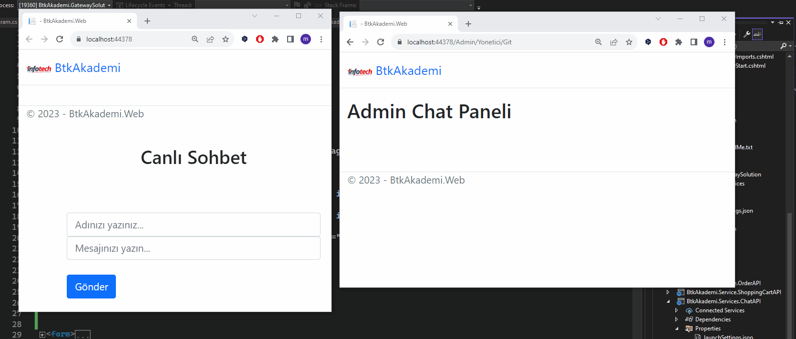

# BTK Akademi Microservice Mimarisiyle E-Ticaret Projesi

BTK Akademi .NET kursunda yapılan e-ticaret projesinin SignalR teknolojisiyle "Canlı Müşteri Destek" eklenmiş halidir.

Chat ekranı

 

## Neler Yapıldı?

SignalR kütüphanesi ile BtkAkademi.Service.ChatAPI oluşturuldu.

Web tarafında JavaScript ile input objesinin "yazıyor" işlemi yakalandı ve admin panelinde socket ile eş zamanlı gösterildi.
