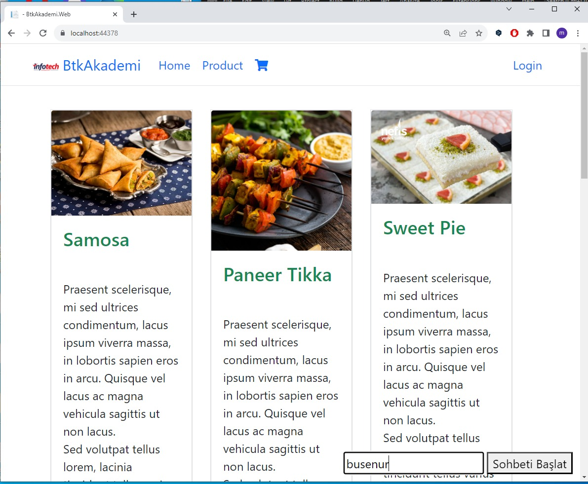
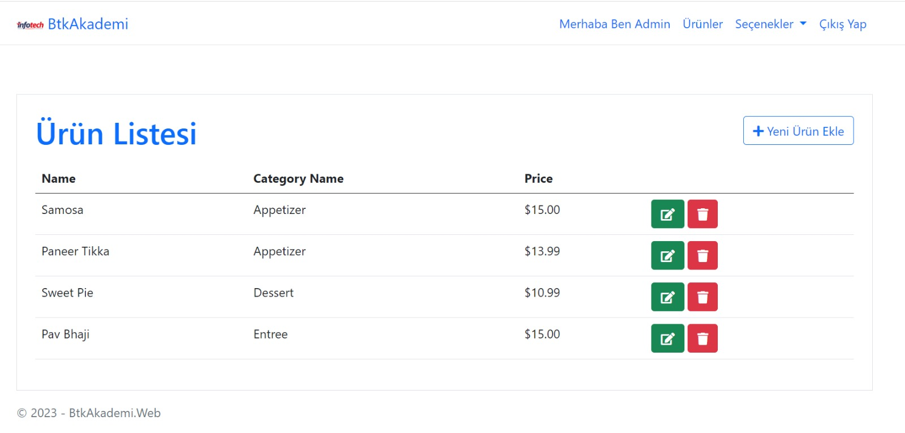
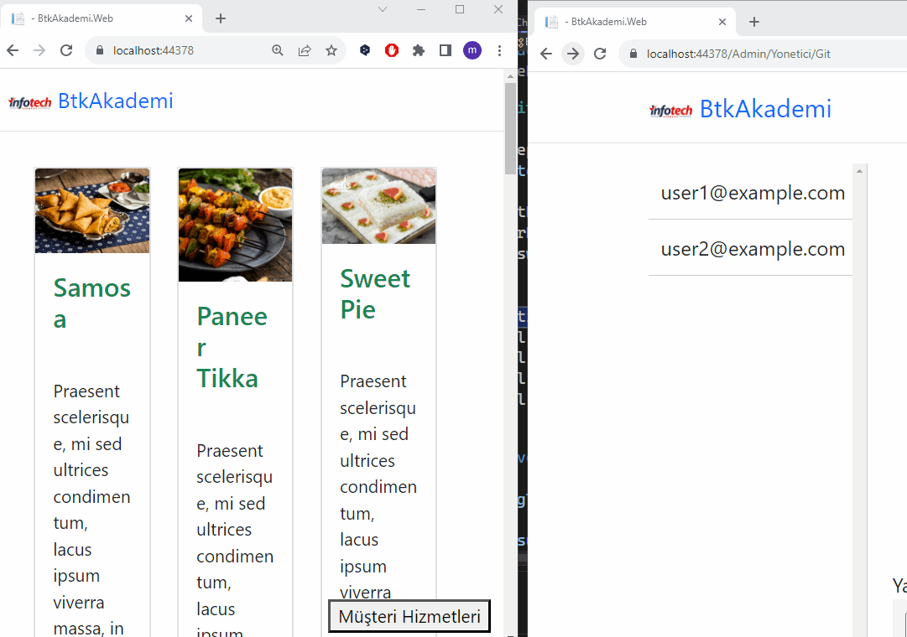

# BTK Akademi Microservice Mimarisiyle E-Ticaret Projesi

BTK Akademi .NET kursunda yapılan e-ticaret projesinin SignalR teknolojisiyle "Canlı Müşteri Destek" eklenmiş halidir.

Ana Sayfa

Ürün Listesi

Müşteri chat bağlantı ekranı

Chat ekranı

 

## Neler Yapıldı?

SignalR kütüphanesi ile BtkAkademi.Service.ChatAPI oluşturuldu.

Web tarafında JavaScript ile input objesinin "yazıyor" işlemi yakalandı ve admin panelinde socket ile eş zamanlı gösterildi.

Her müşteri için ayrı bir alan oluşturarak private chat özelliği eklendi
